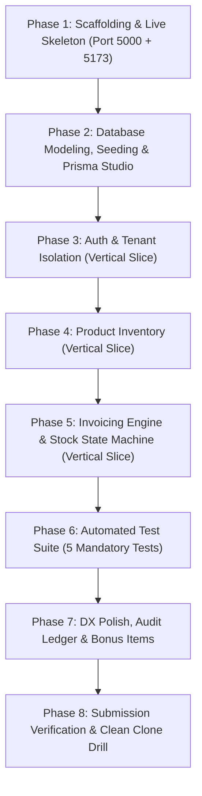

# StockFlow — Master Task List & Implementation Roadmap

This document establishes the **prioritized, vertically sliced implementation roadmap** for **StockFlow** (Inventory & Invoicing Web Application) based on `fullstack-js-take-home-test.md`.

---

## 🎯 Architecture & Execution Strategy: Vertical Slicing

To ensure every phase is **comprehensible, immediately debuggable, and interactive**, the roadmap is structured into **vertical feature slices**. 

Instead of building a detached backend for days before touching the frontend, **each phase delivers a working, interactive prototype increment** (API + Database + UI + Live Verification Checkpoint). You can launch the application at the end of every phase to click around, test features, and visually verify system state.

---

## 📋 Prioritized Master Task List

### Phase 1: Project Scaffolding & Interactive Shell (Foundation)
**Priority:** P0 (Highest)  
**Objective:** Establish unified monorepo development environment with running backend and frontend servers from minute one.

- [ ] Initialize monorepo directory layout:
  - [ ] `server/` (Node.js + Express + TypeScript)
  - [ ] `client/` (React + Vite + TypeScript + Tailwind CSS + Lucide Icons)
- [ ] Configure root `package.json` with scripts:
  - [ ] `npm run dev`: Boots server (`:5000`) and client (`:5173`) concurrently.
  - [ ] `npm run build`: Compiles both projects.
  - [ ] `npm test`: Runs automated test suite.
  - [ ] `npm run db:migrate` & `npm run db:seed`: Database controls.
- [ ] Set up server structure:
  - [ ] `server/src/app.ts` with CORS, JSON body parser, and request logger.
  - [ ] Health check endpoint: `GET /api/health` returning uptime and status.
  - [ ] Mount Swagger / OpenAPI UI at `GET /api/docs`.
- [ ] Set up client structure:
  - [ ] Vite React setup with Tailwind CSS configured.
  - [ ] Root Layout with navigation header and backend connectivity indicator badge.
- [ ] Create `.env.example` and root `.gitignore`.

> 🕹️ **Interactive Debugging & Verification Checkpoint:**
> 1. Run `npm run dev` from root.
> 2. Open `http://localhost:5173` → Verify client renders styled header with green "Backend Connected ✅" status.
> 3. Open `http://localhost:5000/api/health` → Verify JSON `{ status: "ok", uptime: ... }`.
> 4. Open `http://localhost:5000/api/docs` → Verify interactive Swagger API documentation console loads.

---

### Phase 2: Database Layer, Seed Data & Visual Data Inspector
**Priority:** P0 (Highest)  
**Objective:** Model the relational schema with SQLite and Prisma, and equip the developer with a visual database explorer.

- [ ] Configure Prisma ORM in `server/` with SQLite provider (`DATABASE_URL="file:./dev.db"`).
- [ ] Define Prisma Schema:
  - [ ] `User`: `id`, `email` (unique), `passwordHash`, `name`, `createdAt`, `updatedAt`
  - [ ] `Product`: `id`, `userId`, `sku`, `name`, `description`, `unitPrice` (Int, minor cents), `quantityOnHand` (Int), `createdAt`, `updatedAt`
  - [ ] `Invoice`: `id`, `userId`, `invoiceNumber` (unique), `customerName`, `issueDate`, `dueDate`, `status` (Enum: DRAFT, ISSUED, PAID, CANCELLED), `notes`, `subtotal` (Int), `taxRate` (Int), `taxAmount` (Int), `total` (Int), timestamps
  - [ ] `InvoiceItem`: `id`, `invoiceId`, `productId` (optional/restrict), `productName` (snapshot), `unitPrice` (snapshot in cents), `quantity` (>0), `lineTotal` (cents)
  - [ ] `StockMovement`: `id`, `productId`, `invoiceId` (optional), `quantityChange`, `reason`, `createdAt`
- [ ] Compound index: `Product(userId, sku)` unique index for workspace-level SKU uniqueness.
- [ ] Run initial migration (`npx prisma migrate dev --name init`).
- [ ] Implement seed script (`server/prisma/seed.ts`):
  - [ ] Demo user: `demo@stockflow.dev` / `Password123!`
  - [ ] 5 realistic distribution products with varying stock counts and prices.
- [ ] Configure `npm run db:studio` script in root package.json.

> 🕹️ **Interactive Debugging & Verification Checkpoint:**
> 1. Run `npm run db:migrate` and `npm run db:seed`.
> 2. Run `npm run db:studio` → Launches web interface at `http://localhost:5555`.
> 3. Interactively inspect the database tables, verify the demo user is created with a hashed password, and inspect the 5 seeded products.

---

### Phase 3: Authentication & Workspace Isolation (Vertical Slice)
**Priority:** P0 (Highest)  
**Objective:** End-to-end user registration, login, token management, and workspace tenant protection.

- [ ] **Backend Security Subsystem:**
  - [ ] Bcrypt password hashing utility (salt rounds = 12).
  - [ ] JWT sign and verify helpers with 7-day expiration.
  - [ ] Zod request schemas for register and login payloads (minimum 8 char password).
  - [ ] `POST /api/auth/register`: Create user, return sanitized profile (no password hash).
  - [ ] `POST /api/auth/login`: Validate credentials, return JWT token.
  - [ ] **Security Rule A9:** Obfuscate failure reasons (always return generic `"Invalid email or password"` on both missing user and wrong password).
  - [ ] `GET /api/auth/me`: Return authenticated user info.
  - [ ] `POST /api/auth/logout`: Acknowledge client token invalidation.
  - [ ] `authenticate` middleware: Verify Bearer token from header; reject with HTTP 401 if missing or invalid.
  - [ ] Multi-tenant isolation helper: inject `where: { userId: req.user.id }` into database queries.
- [ ] **Frontend Authentication UI & State:**
  - [ ] Axios client with request interceptor (attaches `Authorization: Bearer <token>`) and 401 interceptor.
  - [ ] `AuthContext` with login, logout, and token persistence in localStorage.
  - [ ] `/login` screen: Email & password fields, client validation, server error banner.
  - [ ] `/register` screen: Full name, email, password fields.
  - [ ] `ProtectedRoute` wrapper: Automatically redirects unauthenticated visitors to `/login`.
  - [ ] User status bar in Navbar displaying logged-in user name and a "Logout" button.

> 🕹️ **Interactive Debugging & Verification Checkpoint:**
> 1. Open `http://localhost:5173/products` while logged out → Verify immediate redirect to `/login`.
> 2. Attempt login with wrong password (`wrongpass`) → See red error banner: "Invalid email or password" (HTTP 401).
> 3. Login with `demo@stockflow.dev` / `Password123!` → Login succeeds, token stored, redirected to dashboard with user avatar/name.
> 4. Click "Logout" → Token cleared, immediately redirected back to `/login`.
> 5. Open Swagger UI at `http://localhost:5000/api/docs`, paste JWT into Authorize modal, execute `/api/auth/me` to verify API auth.

---

### Phase 4: Product Inventory Management (Vertical Slice)
**Priority:** P1 (Core Feature)  
**Objective:** Full-featured product catalog management with real-time search, pagination, and deletion referential guards.

- [ ] **Backend Product CRUD:**
  - [ ] Zod schemas: `sku` (string, min 1), `name` (string, min 1), `unitPrice` (integer ≥ 0 in minor units), `quantityOnHand` (integer ≥ 0), `description` (optional).
  - [ ] `POST /api/products`: Create product, enforce unique SKU within user workspace.
  - [ ] `GET /api/products`: Paginated product list with search query (`?search=xyz&page=1&limit=10`).
  - [ ] `GET /api/products/:id`: Fetch single product by ID (scoped to `userId`).
  - [ ] `PUT /api/products/:id`: Update product attributes.
  - [ ] `DELETE /api/products/:id`:
    - [ ] **Referential Guard (I4):** Query if product is referenced by any `InvoiceItem`.
    - [ ] If referenced: Block deletion with HTTP 409 Conflict (`"Cannot delete product '[Name]' because it is referenced in one or more invoices."`).
    - [ ] If not referenced: Safely delete product.
- [ ] **Frontend Product Catalog UI:**
  - [ ] `/products` view with search input (with 300ms debounce).
  - [ ] Responsive product table displaying SKU, Name, Description, Unit Price (formatted in localized currency), and Quantity on Hand.
  - [ ] Pagination controls (`Previous`, `Page X of Y`, `Next`).
  - [ ] "New Product" modal with integer cents conversion from dollar input.
  - [ ] "Edit Product" modal with prefilled data.
  - [ ] Delete button with confirmation modal and error toast handling (displays 409 error clearly).

> 🕹️ **Interactive Debugging & Verification Checkpoint:**
> 1. In browser, navigate to `/products` → Verify the 5 seeded products render with formatted prices and stock levels.
> 2. Type "Widget" or an SKU in the search box → Table dynamically filters.
> 3. Click "New Product" → Create "Smart Sensor X" with Price `$45.50` (internally stored as `4550` cents) and Stock `10`.
> 4. Verify "Smart Sensor X" appears at top of table with `$45.50` and stock `10`.
> 5. Edit "Smart Sensor X" stock to `15` → Verify table updates instantly.
> 6. Delete "Smart Sensor X" → Verify item is removed.

---

### Phase 5: Invoicing Engine & Stock State Machine (Vertical Slice)
**Priority:** P1 (Core Business Logic — 20% Evaluation Weight)  
**Objective:** Complete invoice creation, live minor-unit currency calculations, atomic stock deduction on issue, and stock restoration on cancellation.

- [ ] **Backend Invoicing & Calculation Engine:**
  - [ ] Invoice sequence generator utility (`INV-YYYY-XXXX`).
  - [ ] Calculation service:
    - [ ] $\text{lineTotal} = \text{quantity} \times \text{unitPrice}$ (all integers).
    - [ ] $\text{subtotal} = \sum \text{lineTotal}$.
    - [ ] $\text{taxAmount} = \text{Math.round}((\text{subtotal} \times \text{DEFAULT\_TAX\_PERCENT}) / 100)$ (default 11%).
    - [ ] $\text{total} = \text{subtotal} + \text{taxAmount}$.
    - [ ] Server recalculates all values; never trusts client-submitted totals.
  - [ ] `POST /api/invoices`:
    - [ ] Validate non-empty items array.
    - [ ] **Stock Guard (V5):** Check $\forall i, \text{item}_i.\text{quantity} \le \text{product}_i.\text{quantityOnHand}$. Reject with HTTP 422 if insufficient.
    - [ ] **Snapshotting (V4):** Store current `product.name` and `product.unitPrice` onto `InvoiceItem`.
    - [ ] Create invoice in `DRAFT` status.
  - [ ] `GET /api/invoices`: List invoices with status filter (`?status=DRAFT&page=1&limit=10`).
  - [ ] `GET /api/invoices/:id`: Fetch invoice details with snapshot line items.
  - [ ] `PUT /api/invoices/:id`: Allow editing header/items **only** if status is `DRAFT`; reject with 422 if `ISSUED`, `PAID`, or `CANCELLED`.
  - [ ] **State Machine & Atomic Transactions:**
    - [ ] `POST /api/invoices/:id/issue` (`DRAFT` → `ISSUED`):
      - [ ] Wrap in `prisma.$transaction`.
      - [ ] Re-verify current stock on hand for all line items.
      - [ ] Decrement each product's `quantityOnHand` atomically.
      - [ ] Record `StockMovement` entries (`reason: "INVOICE_ISSUED"`).
      - [ ] Update invoice status to `ISSUED`.
    - [ ] `POST /api/invoices/:id/pay` (`ISSUED` → `PAID`):
      - [ ] Validate status transition; mark status as terminal `PAID`.
    - [ ] `POST /api/invoices/:id/cancel`:
      - [ ] If status is `ISSUED`: wrap in transaction, restore stock (`quantityOnHand += item.quantity`), record `StockMovement` (`reason: "INVOICE_CANCELLED"`), update to `CANCELLED`.
      - [ ] If status is `DRAFT`: update to `CANCELLED` (no stock adjustments).
      - [ ] If status is `PAID` or `CANCELLED`: reject with HTTP 422 (terminal state).
- [ ] **Frontend Invoicing UI:**
  - [ ] `/invoices` view: Filterable status tabs (`All`, `DRAFT`, `ISSUED`, `PAID`, `CANCELLED`), status pill badges with distinct colors, and paginated table.
  - [ ] `/invoices/new` Interactive Invoice Creator:
    - [ ] Customer Name, Issue Date, Due Date, Notes.
    - [ ] Dynamic line item row builder:
      - [ ] Product selector showing real-time available stock badge.
      - [ ] Quantity input with instant client validation warning if requested > available stock.
      - [ ] Live line total computation.
      - [ ] Add line / Remove line buttons.
    - [ ] Live Summary Card: Reactive Subtotal, Tax (11%), and Grand Total.
    - [ ] "Save as Draft" button.
  - [ ] `/invoices/:id` Invoice Detail View:
    - [ ] Formatted printable invoice layout.
    - [ ] Dynamic Action Bar based on invoice state:
      - [ ] `DRAFT`: "Issue Invoice", "Edit", "Cancel Invoice".
      - [ ] `ISSUED`: "Mark as Paid", "Cancel Invoice".
      - [ ] `PAID` / `CANCELLED`: Read-only badge indicator.

> 🕹️ **Interactive Debugging & Verification Checkpoint:**
> 1. Navigate to `/invoices/new`.
> 2. Pick "Demo Product A" (suppose stock = 10), type quantity `15` → Observe live warning: "Requested quantity (15) exceeds available stock (10)".
> 3. Adjust quantity to `2`, add a second product line for `1` unit → Watch Subtotal, 11% Tax, and Total calculate reactively.
> 4. Submit invoice → Redirected to `/invoices/:id` in `DRAFT` status.
> 5. Click "Issue Invoice" → Status badge transitions to `ISSUED`.
> 6. Open `/products` in a new tab → Verify stock for "Demo Product A" automatically decreased by 2!
> 7. Return to invoice detail and click "Cancel Invoice" → Status becomes `CANCELLED`.
> 8. Refresh `/products` → Verify stock was restored to its original value!
> 9. Try deleting "Demo Product A" from `/products` → See HTTP 409 Conflict alert ("Product is referenced in invoice").

---

### Phase 6: Automated Testing Suite & Regression Shield
**Priority:** P1 (Mandatory Requirement N4 — 8% Evaluation Weight)  
**Objective:** Codify all mandatory business invariants into fast, automated Vitest + Supertest integration suites.

- [ ] Setup Vitest test runner in `server/` with isolated test SQLite database.
- [ ] Implement Mandatory Test Suite (`server/tests/core.test.ts`):
  - [ ] **Test 1 (Auth):** Login with wrong password returns HTTP 401.
  - [ ] **Test 2 (Auth):** Unauthenticated request to protected endpoints (`/api/products`, `/api/invoices`) returns HTTP 401.
  - [ ] **Test 3 (Stock Guard):** Invoicing quantity exceeding `quantityOnHand` returns HTTP 422 with stock error.
  - [ ] **Test 4 (Atomic Issue):** Issuing an invoice decrements product stock on hand accurately in database.
  - [ ] **Test 5 (Atomic Cancel):** Cancelling an issued invoice restores product stock on hand accurately.
- [ ] Implement Edge Case Test Suite (`server/tests/edge-cases.test.ts`):
  - [ ] Deleting a product referenced in an invoice returns HTTP 409 Conflict.
  - [ ] Updating a product catalog price does NOT alter unit price on historical invoices.
  - [ ] Illegal state transitions (e.g. attempting to pay a `DRAFT` invoice or edit an `ISSUED` invoice) return HTTP 422.
- [ ] Configure `npm test` script in root package.json to execute tests and report clean output.

> 🕹️ **Interactive Debugging & Verification Checkpoint:**
> 1. Run `npm test` from root terminal.
> 2. Observe Vitest console output executing tests against the test database.
> 3. Verify all 5 mandatory test suites pass with 100% green checkmarks in < 2 seconds.

---

### Phase 7: Developer Experience, DX Polish & Bonus Enhancements
**Priority:** P2 (High Value Extras)  
**Objective:** Add high-impact polish and optional bonus features from Section 6 without over-scoping.

- [ ] **Audit Trail Ledger (Bonus):**
  - [ ] Display product stock movement history in product detail / drawer (`StockMovement` table).
- [ ] **Rate Limiting (Bonus):**
  - [ ] Implement `express-rate-limit` on `/api/auth/login` (e.g. max 10 attempts per 15 minutes per IP).
- [ ] **Print / PDF View (Bonus):**
  - [ ] Add clean `@media print` CSS styling on invoice detail page with "Print / Save PDF" button.
- [ ] **UI Polish & Feedback:**
  - [ ] Animated loading skeletons on tables and cards.
  - [ ] Clean error toast notifications via `react-hot-toast` or simple toast alert component.
  - [ ] Empty state illustrations when lists are empty.
- [ ] **Swagger Documentation Completeness:**
  - [ ] Ensure all endpoints, request bodies, and standard error responses are annotated in `/api/docs`.

> 🕹️ **Interactive Debugging & Verification Checkpoint:**
> 1. On `/invoices/:id`, click "Print / Save as PDF" → Browser opens clean, unbranded print preview formatted for paper.
> 2. Rapidly spam invalid login submissions 10 times → Receive HTTP 429 "Too Many Requests" rate-limit response.
> 3. Open `/api/docs` and execute each API route interactively through the Swagger web UI.

---

### Phase 8: Submission Readiness & Evaluation Verification
**Priority:** P1 (Delivery Critical)  
**Objective:** Ensure zero-friction evaluator onboarding and flawless compliance with submission checklist.

- [ ] Write comprehensive, high-clarity `README.md`:
  - [ ] Prerequisites (Node.js v20+).
  - [ ] Zero-friction quickstart steps (`git clone` → `npm install` → `npm run db:seed` → `npm run dev`).
  - [ ] Demo credentials (`demo@stockflow.dev` / `Password123!`).
  - [ ] **Tech choices and why** (5–10 structured bullet points).
  - [ ] **Trade-offs and known limitations**.
  - [ ] **"What I would do with one more week"** section.
  - [ ] **AI Usage statement** detailing tools and exact workflows.
  - [ ] Honest time spent estimate.
- [ ] Verify `.env.example` is complete and contains zero actual secrets.
- [ ] Verify clean, incremental git commit history following Conventional Commits format (`feat:`, `fix:`, `test:`, `docs:`).
- [ ] Perform a clean-clone dry run:
  - [ ] Clone repo into a clean directory.
  - [ ] Follow README steps strictly.
  - [ ] Verify app runs and tests pass with **no undocumented steps**.

> 🕹️ **Interactive Debugging & Verification Checkpoint:**
> 1. Execute `git status` to ensure working tree is clean.
> 2. Run clean clone test in a temporary folder: `git clone . temp-check && cd temp-check && npm install && npm run db:seed && npm test`.
> 3. Confirm all tests pass without manual environment tweaking.

---

## 💡 Human-Friendly Summary

### What We Are Building
We are creating **StockFlow**, a focused, professional-grade Inventory & Invoicing web application. It is designed to solve a very specific, real-world business headache: **preventing businesses from selling products they don't actually have in stock**, while keeping their billing records completely accurate and historically trustworthy.

### Core Strengths of Our Solution
1. **Bulletproof Financial Accuracy:**  
   Money is never calculated using standard JavaScript decimals (which produce floating-point glitches like `$0.10 + $0.20 = $0.30000000000000004`). All calculations are carried out in exact integer minor units (cents / Rupiah) and converted only when rendered in the UI.

2. **Strict Inventory Guards:**  
   When an invoice is issued, the application locks the database transaction, verifies that sufficient items are on shelves, and decrements stock atomically. If an issued invoice is cancelled later, the exact inventory is automatically returned to the shelf.

3. **Historical Invariant Protection:**  
   If you raise an invoice for "Leather Jacket" at $150 today, and next month you raise the product's catalog price to $200 or rename it, your historical invoice will forever state "Leather Jacket" at $150. Historical records remain 100% faithful.

4. **Zero-Setup Friction for Evaluators:**  
   By default, the application runs on SQLite with Prisma. Evaluators do not need to install Docker or configure a remote database. They can simply clone, run `npm run db:seed`, `npm run dev`, and be clicking around with pre-populated demo data in under 60 seconds.

5. **Complete Test Suite Included:**  
   All 5 mandatory automated test scenarios required by the evaluation team (unauthorized requests, wrong password, stock limits, stock deduction, and stock restoration) plus edge cases are codified with Vitest and Supertest, passing with a single `npm test` command.

---

## 🔍 Tech Stack Compliance Audit & Justification

### 1. Direct Compliance Mapping (Section 2 of Task Specification)

Every primary technology selected comes directly from the permitted options explicitly enumerated in `fullstack-js-take-home-test.md`:

| Concern | Task Specification Options | Our Selected Choice | Compliance Status |
|---|---|---|---|
| **Server Runtime** | Node.js (Required) | Node.js (v20+ LTS) | ✅ **100% Match** |
| **Backend Framework** | NestJS, Express, Fastify, Hapi, Koa, Next.js API routes | **Express.js** | ✅ **Direct Match** |
| **Frontend Framework** | React, Next.js, Vue, Nuxt, Svelte, Angular, Remix | **React (Vite)** | ✅ **Direct Match** |
| **Programming Language** | JavaScript or TypeScript (TypeScript preferred) | **TypeScript (Strict Mode)** | ✅ **Preferred Match** |
| **Database** | PostgreSQL, MySQL/MariaDB, SQLite, MongoDB ("SQLite counts") | **SQLite** | ✅ **Direct Match** |
| **ORM / Data Layer** | Prisma, TypeORM, Drizzle, Sequelize, Mongoose, Knex, raw SQL | **Prisma ORM** | ✅ **Direct Match** |
| **Styling / UI Kit** | Tailwind, MUI, Chakra, shadcn/ui, Bootstrap, plain CSS | **Tailwind CSS** | ✅ **Direct Match** |
| **Project Layout** | Monorepo or Two Folders | **Monorepo (`server/` + `client/`)** | ✅ **Direct Match** |
| **Auth Credential** | JWT or httpOnly session cookie (Section 4.1 A2) | **JWT (Bearer Token)** | ✅ **Direct Match** |
| **Password Hashing** | Bcrypt or Argon2 with salt (Section 4.1 A4) | **Bcrypt (12 rounds)** | ✅ **Direct Match** |
| **API Documentation** | Swagger/OpenAPI, Postman/Bruno, README table (Section 5 N5) | **Swagger / OpenAPI (`swagger-ui-express`)** | ✅ **Direct Match** |

---

### 2. Complementary Libraries Not Formally Enumerated in Section 2 & Technical Justifications

The task specification leaves specific sub-libraries (validation, testing framework, HTTP client, client-side cache) to developer discretion while mandating strict behavioral outcomes (e.g. "Server-side validation returning 400/422", "at minimum 5 automated tests", "loading and error states"). Below are the specific libraries chosen and why:

#### A. Zod (Runtime Schema & Request Validation)
- **Why It Was Chosen:**  
  Requirement **I3** and **A5** require strict server-side validation returning structured field-level 400/422 error responses. Zod provides declarative, type-inferred validation that bridges TypeScript compile-time types with runtime HTTP boundaries. It eliminates boilerplate validation checks and prevents malformed data from ever touching controllers or services.

#### B. Vitest & Supertest (Automated Testing Framework)
- **Why It Was Chosen:**  
  Requirement **N4** mandates at least 5 automated integration tests executable with a single command. Vitest executes TypeScript natively with ES modules without complex Babel/ts-jest transformation overhead. Paired with Supertest, it enables testing HTTP endpoints and Prisma transactions against an ephemeral SQLite test database in milliseconds.

#### C. TanStack Query / React Query & Axios (Client State & HTTP Requests)
- **Why It Was Chosen:**  
  Requirement **F6** requires smooth loading skeletons, spinners, and error alerts without leaving the user staring at blank screens. TanStack Query provides out-of-the-box declarative query states (`isLoading`, `isError`, `data`), automatic background cache revalidation, and mutation triggers for seamless UI updates upon product/invoice mutations. Axios simplifies setting up global request interceptors to automatically attach JWT Bearer tokens and handle 401 redirects.

#### D. Lucide React (Iconography)
- **Why It Was Chosen:**  
  Provides featherweight, accessible SVG icons (status badges, action buttons, search icons) that pair seamlessly with Tailwind CSS classes without introducing bulky component library overhead.
