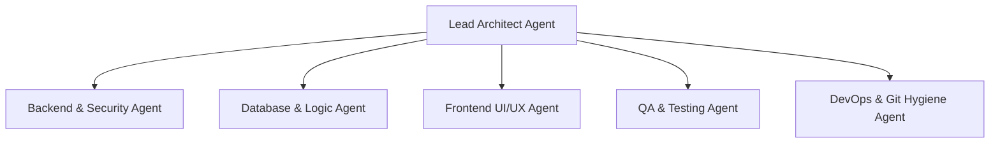

# AI Agents Operating Guide — StockFlow (THT-ETERNA)

This document establishes the operational protocols, roles, constraints, and development guidelines for autonomous or pair-programming AI agents working within the **StockFlow** codebase.

---

## 1. Project Overview & Context

- **Application Name:** StockFlow — Minimal Inventory & Invoicing System
- **Repository:** `OREOP4IN/THT-ETERNA`
- **Objective:** Build a robust, production-grade inventory and invoicing web application designed to solve stock overselling for small distribution businesses.
- **Evaluation Priority:** Correctness of business logic (stock, money, invoice state machine), secure authentication, clear architecture, zero-friction setup, meaningful automated tests, and disciplined git hygiene.

---

## 2. Technology Stack & Architectural Decisions

| Layer | Technology | Rationale |
|---|---|---|
| **Runtime & Language** | Node.js (v20+ LTS), TypeScript (Strict Mode) | Strong type safety, seamless full-stack DX, preferred by evaluation criteria. |
| **Backend Framework** | Express.js (Modular Layered Architecture) | Lightweight, idiomatic, clear separation of concerns (Routes → Controllers → Services → Data Access). |
| **Database & ORM** | SQLite via Prisma ORM | Zero-friction local setup (no external DB install or Docker needed for reviewer clone-and-run); easily switchable to PostgreSQL via `DATABASE_URL`. |
| **Data Validation** | Zod | Runtime schema validation with automatic TypeScript type inference for all request payloads and queries. |
| **Authentication** | JWT + Argon2 / Bcrypt | Secure password hashing with salt, stateless token verification, opaque auth error messaging. |
| **Frontend Framework** | React (Vite) + TypeScript | Fast HMR, minimal bundle size, typed component interfaces. |
| **Styling** | Tailwind CSS + Lucide React | Clean, functional, modern, responsive UI without bloat. |
| **State & Data Fetching**| TanStack Query (React Query) + Axios | Robust cache management, declarative loading/error states, easy invalidation. |
| **Testing Framework** | Vitest + Supertest | Blazing-fast execution, native TypeScript support, direct API integration testing. |
| **API Documentation** | Swagger / OpenAPI (`swagger-ui-express`) | Interactive API exploration at `/api/docs`. |

---

## 3. Agent Roles & Responsibilities

When executing tasks, agents should adopt the mindset of one or more of the following specialized roles:

### 3.1 Lead Architect Agent
- **Mission:** Guard system invariants, enforce modular boundaries, and ensure compliance with evaluation rubric.
- **Responsibilities:**
  - Verify overall directory structure and dependencies.
  - Ensure zero undocumented steps exist in the setup pipeline.
  - Review all cross-cutting changes before final commits.

### 3.2 Backend & Security Agent
- **Mission:** Implement secure, resilient, and standardized REST endpoints.
- **Responsibilities:**
  - Authentication flow (`/api/auth/register`, `/api/auth/login`, `/api/auth/logout`, `/api/auth/me`).
  - Auth middleware ensuring `401 Unauthorized` for missing/invalid tokens.
  - User isolation: Enforce `where: { userId }` across all product and invoice operations.
  - Generic error handler returning uniform error shape (`{ error: { message, code, details } }`).

### 3.3 Database & Business Logic Agent
- **Mission:** Guarantee data integrity, strict mathematical precision, and transactional safety.
- **Responsibilities:**
  - **Money Precision:** Store all monetary values as integers in minor units (e.g. cents/rupiah). Never use floating-point types for currency math.
  - **Stock Guard:** Reject invoice line quantities that exceed available `quantityOnHand`.
  - **Atomic Transitions:** Wrap invoice issuing (`DRAFT` → `ISSUED`) and stock deduction in Prisma transactions (`$transaction`).
  - **Stock Restoration:** On invoice cancellation (`ISSUED` → `CANCELLED`), atomically restore stock.
  - **State Machine Guard:** Enforce allowed state transitions: `DRAFT -> ISSUED -> PAID`, `DRAFT -> CANCELLED`, `ISSUED -> CANCELLED`. Reject illegal mutations.
  - **Product Referential Integrity:** Prevent silent deletion of products linked to existing invoices.

### 3.4 Frontend UI/UX Agent
- **Mission:** Build a functional, responsive, and intuitive web client.
- **Responsibilities:**
  - Auth views (Login & Register) with clear server error presentation.
  - Products management (Paginated table, search input, Create/Edit/Delete modals).
  - Invoice creation form with dynamic line items, auto-completing product selection, live calculation of line totals, subtotal, tax (11%), and grand total.
  - Invoice list with status filter badge and detail view with action buttons (Issue, Mark as Paid, Cancel).
  - Authenticated layout router: redirect unauthenticated users to `/login`.
  - Clear loading skeletons, spinners, and error alerts.

### 3.5 QA & Test Automation Agent
- **Mission:** Ensure bulletproof stability and 100% pass rate on mandatory test scenarios.
- **Responsibilities:**
  - Implement minimum required automated tests:
    1. Login with incorrect password returns 401/400.
    2. Unauthenticated request to protected route returns 401.
    3. Invoicing quantity exceeding `quantityOnHand` returns 400/422 stock error.
    4. Issuing an invoice decrements product stock atomically.
    5. Cancelling an issued invoice restores stock atomically.
  - Provide additional unit/integration tests for edge cases (e.g., negative money, illegal state transition).
  - Ensure all tests run with a single command (`npm test`).

### 3.6 DevOps & Git Hygiene Agent
- **Mission:** Deliver exceptional developer experience and clean version history.
- **Responsibilities:**
  - Maintain `.env.example` with zero actual secrets.
  - Maintain seed script with reliable demo user and products.
  - Maintain detailed `README.md` following project instructions.
  - Commit in logical, incremental steps using Conventional Commits (`feat:`, `fix:`, `test:`, `docs:`, `refactor:`).

---

## 4. Invariant Rules (Must Never Be Broken)

1. **NO Floating Point Math for Money:**
   All money columns in database and server calculations must be integers (cents). Conversion to human-readable decimals occurs strictly at the presentation layer.
2. **NO Cross-User Data Leaks:**
   Every read, create, update, or delete on products or invoices MUST be scoped to the authenticated user ID (`req.user.id`).
3. **NO Negative Inventory:**
   Stock decrement must verify `quantityOnHand >= quantityRequested` before deduction.
4. **NO Direct Stock Updates Outside Transactions:**
   Invoice status change affecting inventory MUST run inside a DB transaction with row locking / atomic decrement.
5. **NO Silent Product Deletions:**
   Deleting a product referenced in an invoice must be blocked with an informative HTTP 409 Conflict error.
6. **NO Generic Secrets in Repository:**
   Never commit `.env`. All secrets must default gracefully in development or be supplied via environment variables.

---

## 5. Coding & Workflow Standards

- **Folder Structure:** Monorepo with `server` and `client` (or `apps/backend` and `apps/frontend`) with unified root scripts.
- **TypeScript:** Strict type checking enabled (`strict: true`, no implicit `any`).
- **Formatting:** Prettier + ESLint conventions.
- **Commit Style:** Conventional Commits:
  - `feat(auth): implement JWT login and password hashing`
  - `feat(inventory): add product CRUD with pagination and search`
  - `feat(invoices): add invoice creation with stock guard and atomic issue`
  - `test(core): add 5 mandatory automated test suites`
  - `docs: add comprehensive README with setup and demo credentials`
