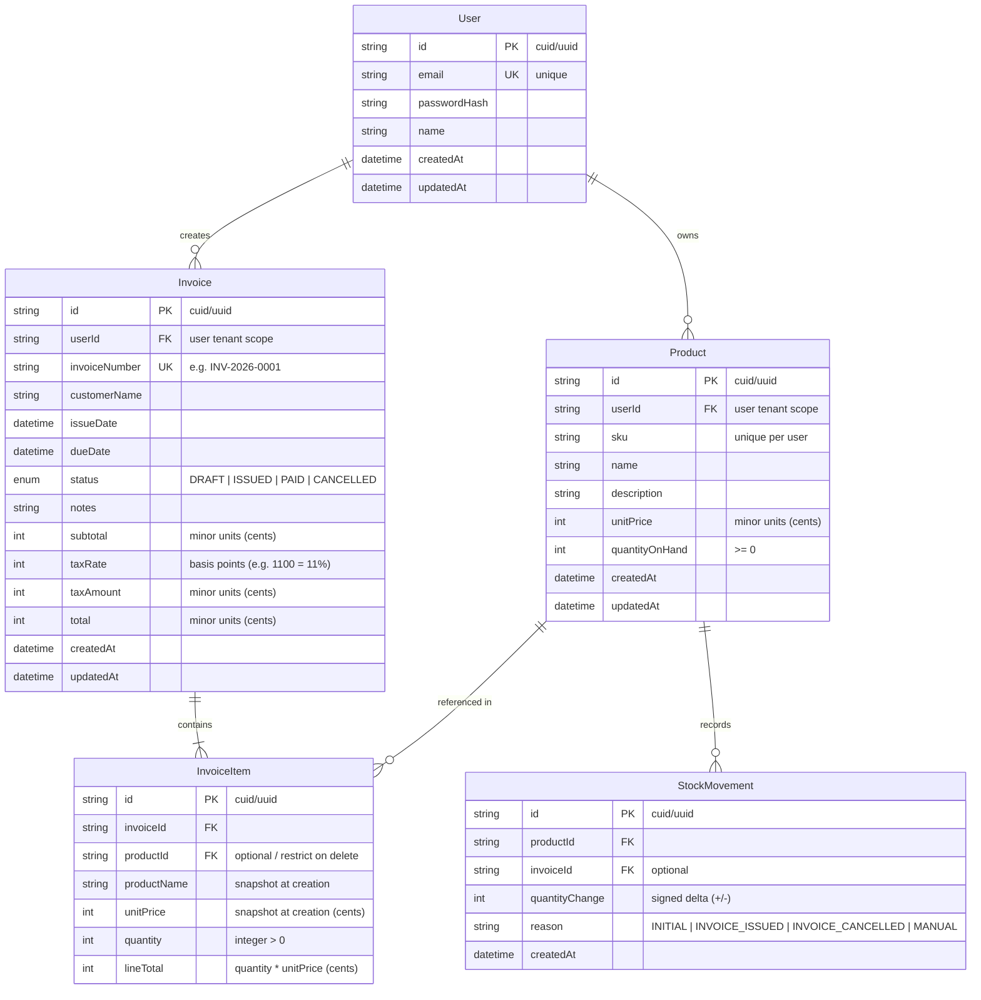
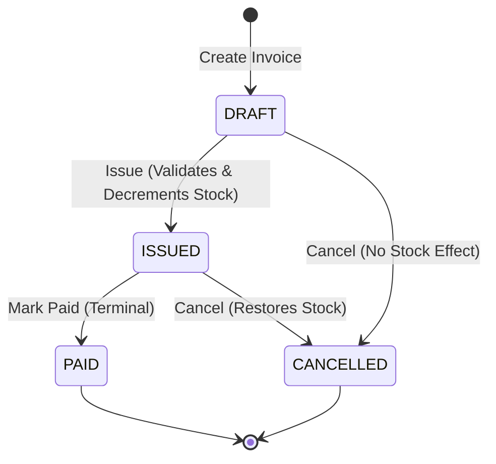

# System Design Document — StockFlow (THT-ETERNA)

**Project:** StockFlow — Minimal Inventory & Invoicing System  
**Author:** AI Engineering Team & Deovie Lentera H.  
**Version:** 1.0.0  
**Target Submission:** Full-Stack JavaScript Developer Take-Home Test  

---

## 1. System Overview & Problem Statement

Small distribution businesses frequently face stock overselling when managing inventory and invoicing through disconnected spreadsheets. **StockFlow** is an integrated web platform that unifies inventory tracking with customer invoicing.

### Key Capabilities
1. **Multi-tenant User Isolation:** Every user manages their independent workspace of products and invoices.
2. **Strict Stock Accounting:** Real-time stock guards and atomic transactional inventory adjustments upon invoice lifecycle state changes.
3. **Immutability & Historical Fidelity:** Product prices and names are snapshotted onto invoice line items at creation time.
4. **Zero-Drift Financials:** Strict integer-minor-unit currency mathematics preventing floating-point rounding errors.

---

## 2. High-Level Architecture

The system follows a clean **Monorepo / Two-Tier Modular Layered Architecture** with distinct client and server workspaces:

```mermaid
graph LR
    subgraph Client ["Frontend (React + Vite + Tailwind)"]
        UI[UI Components & Pages]
        Query[TanStack Query Cache]
        APIClient[Axios Client with Auth Interceptor]
        UI --> Query --> APIClient
    end

    subgraph Server ["Backend (Node.js + Express + TypeScript)"]
        Router[Express Router]
        AuthMW[Auth Middleware (JWT)]
        ValidateMW[Zod Validation Middleware]
        Controllers[API Controllers]
        Services[Business Logic Services]
        PrismaClient[Prisma ORM Client]
        
        Router --> AuthMW --> ValidateMW --> Controllers --> Services --> PrismaClient
    end

    subgraph DataStore ["Database Layer"]
        SQLite[(SQLite Database / Prisma)]
        PrismaClient --> SQLite
    end

    APIClient -- HTTP / REST (JSON) --> Router
```

### Directory Structure

```
THT-ETERNA/
├── package.json                 # Root orchestration scripts (dev, build, test, seed)
├── README.md                    # Setup, run, tests, architectural rationale & AI usage
├── agents.md                    # Operational protocols & agent roles
├── design.md                    # Architectural & domain design specification
├── TODO.md                      # Complete implementation task list & summary
├── fullstack-js-take-home-test.md # Original test requirement specification
│
├── server/                      # Backend application (Express + TypeScript)
│   ├── src/
│   │   ├── config/              # Environment variables & constants
│   │   ├── controllers/         # HTTP request/response handlers
│   │   ├── middleware/          # Auth, error handling, validation
│   │   ├── routes/              # Express route declarations
│   │   ├── services/            # Pure business logic & Prisma transactions
│   │   ├── schemas/             # Zod validation schemas
│   │   ├── utils/               # Money formatting, invoice number generator
│   │   ├── app.ts               # Express app instance & middleware mounting
│   │   └── index.ts             # Server entry point
│   ├── prisma/
│   │   ├── schema.prisma        # Database schema definitions
│   │   ├── migrations/          # Version-controlled migrations
│   │   └── seed.ts              # Seed script (demo user + initial products)
│   ├── tests/                   # Integration test suites (Vitest + Supertest)
│   ├── tsconfig.json
│   └── package.json
│
└── client/                      # Frontend application (React + Vite + Tailwind)
    ├── src/
    │   ├── api/                 # Axios instance & API client endpoints
    │   ├── components/          # Reusable UI (Navbar, Table, Modal, Badge, Button)
    │   ├── context/             # AuthContext (token storage & current user)
    │   ├── hooks/               # Custom hooks (e.g. useProducts, useInvoices)
    │   ├── pages/               # Route views (Login, Register, Products, Invoices)
    │   ├── types/               # TypeScript interfaces & DTOs
    │   ├── utils/               # Currency formatters, date formatters
    │   ├── App.tsx              # Application routes & layout
    │   └── main.tsx             # React entry point
    ├── tsconfig.json
    ├── tailwind.config.js
    └── package.json
```

---

## 3. Data Modeling & Database Schema

The database layer uses Prisma ORM with SQLite for frictionless local setup, with seamless compatibility with PostgreSQL.



### Prisma Schema Draft

```prisma
datasource db {
  provider = "sqlite"
  url      = env("DATABASE_URL")
}

generator client {
  provider = "prisma-client-js"
}

enum InvoiceStatus {
  DRAFT
  ISSUED
  PAID
  CANCELLED
}

model User {
  id           String    @id @default(uuid())
  email        String    @unique
  passwordHash String
  name         String
  createdAt    DateTime  @default(now())
  updatedAt    DateTime  @updatedAt
  products     Product[]
  invoices     Invoice[]
}

model Product {
  id             String          @id @default(uuid())
  userId         String
  user           User            @relation(fields: [userId], references: [id], onDelete: Cascade)
  sku            String
  name           String
  description    String?
  unitPrice      Int             // Stored in cents (e.g. $10.50 -> 1050)
  quantityOnHand Int             // Non-negative inventory
  createdAt      DateTime        @default(now())
  updatedAt      DateTime        @updatedAt
  invoiceItems   InvoiceItem[]
  stockMovements StockMovement[]

  @@unique([userId, sku])
  @@index([userId, name])
}

model Invoice {
  id            String          @id @default(uuid())
  userId        String
  user          User            @relation(fields: [userId], references: [id], onDelete: Cascade)
  invoiceNumber String          @unique
  customerName  String
  issueDate     DateTime
  dueDate       DateTime
  status        InvoiceStatus   @default(DRAFT)
  notes         String?
  subtotal      Int             // Cents
  taxRate       Int             @default(1100) // 11.00% represented as 1100 basis points
  taxAmount     Int             // Cents
  total         Int             // Cents
  createdAt     DateTime        @default(now())
  updatedAt     DateTime        @updatedAt
  items         InvoiceItem[]
  stockMovements StockMovement[]

  @@index([userId, status])
  @@index([userId, invoiceNumber])
}

model InvoiceItem {
  id          String   @id @default(uuid())
  invoiceId   String
  invoice     Invoice  @relation(fields: [invoiceId], references: [id], onDelete: Cascade)
  productId   String?
  product     Product? @relation(fields: [productId], references: [id], onDelete: Restrict)
  productName String   // Permanent snapshot
  unitPrice   Int      // Permanent snapshot in cents
  quantity    Int      // > 0
  lineTotal   Int      // quantity * unitPrice (cents)
}

model StockMovement {
  id             String   @id @default(uuid())
  productId      String
  product        Product  @relation(fields: [productId], references: [id], onDelete: Cascade)
  invoiceId      String?
  invoice        Invoice? @relation(fields: [invoiceId], references: [id], onDelete: SetNull)
  quantityChange Int      // Negative when issued, positive when restored
  reason         String   // "INITIAL", "INVOICE_ISSUED", "INVOICE_CANCELLED", "MANUAL"
  createdAt      DateTime @default(now())
}
```

---

## 4. Business Invariants & State Transition Machine

### 4.1 Money Calculation & Minor Units
- **Currency Unit:** Cents (integer).
- **Line Total:** $\text{lineTotal} = \text{quantity} \times \text{unitPrice}$.
- **Subtotal:** $\text{subtotal} = \sum \text{lineTotal}_i$.
- **Tax Calculation:** Default rate 11% (or configurable via `DEFAULT_TAX_PERCENT` env var).
  $$\text{taxAmount} = \text{Math.round}\left(\frac{\text{subtotal} \times \text{TAX\_RATE\_PERCENT}}{100}\right)$$
- **Grand Total:** $\text{total} = \text{subtotal} + \text{taxAmount}$.
- **Client vs Server:** Client computes live totals for user feedback; **server recomputes and overrides all calculations strictly** from database unit prices and requested quantities.

### 4.2 Invoice State Machine



#### Allowed Transitions Matrix
| Current Status | Target Status | Precondition / Side Effect |
|---|---|---|
| `DRAFT` | `ISSUED` | **Stock Check:** $\forall i, \text{item}_i.\text{quantity} \le \text{product}_i.\text{quantityOnHand}$.<br>**Atomic Action:** Decrement stock for all lines; record `StockMovement`. |
| `DRAFT` | `CANCELLED` | No stock adjustments. State marked terminal. |
| `ISSUED` | `PAID` | Payment confirmed. Terminal state. |
| `ISSUED` | `CANCELLED` | **Atomic Action:** Increment product stock for all lines; record `StockMovement`. |
| `*` | Any other | **HTTP 422 Unprocessable Entity:** "Invalid state transition from {current} to {target}." |
| `PAID` / `CANCELLED` | Any | **Terminal:** No further updates permitted. |

### 4.3 Stock Guards & Concurrency
When transitioning `DRAFT` → `ISSUED`:
1. Execute inside `prisma.$transaction(async (tx) => { ... })`.
2. Fetch current `quantityOnHand` for each item's product within the transaction.
3. If any product has `quantityOnHand < item.quantity`, rollback transaction immediately with:
   `"Insufficient stock for product '[Name]'. Available: X, Requested: Y."`
4. Deduct quantity atomically:
   `tx.product.update({ where: { id }, data: { quantityOnHand: { decrement: item.quantity } } })`.

### 4.4 Product Immutability & Referential Integrity
- Changing a product's price in the inventory table updates future invoices only.
- Invoices store `productName` and `unitPrice` in `InvoiceItem`. Historical invoices reflect exact data at time of creation.
- Deletion of a product referenced in an existing invoice is blocked (`onDelete: Restrict`) with HTTP 409 Conflict:
  `"Cannot delete product '[Name]' because it is referenced in one or more invoices."`

---

## 5. Security & Authentication Architecture

### 5.1 Registration & Login
- Password hashing: **Bcrypt** with cost factor 12 (or **Argon2id**).
- Password validation policy: minimum 8 characters, checked server-side via Zod.
- Email normalization: `email.trim().toLowerCase()` with standard RFC 5322 regex.
- **Opaque error response:** For failed logins, always return HTTP 401:
  `{ "error": { "code": "INVALID_CREDENTIALS", "message": "Invalid email or password." } }`. Never disclose whether email exists.

### 5.2 Token Transmission & Protection
- JWT payload: `{ sub: user.id, email: user.email }`.
- Expiry: 7 days.
- Transport: `Authorization: Bearer <token>` header.
- Multi-tenancy guard: Auth middleware extracts `req.user.id`. Every database query in services strictly includes `{ where: { userId: req.user.id } }`.

---

## 6. REST API Specification

### Standard Response Envelopes

**Success (Single Entity):**
```json
{
  "data": { ... }
}
```

**Success (Paginated List):**
```json
{
  "data": [ ... ],
  "meta": {
    "page": 1,
    "limit": 10,
    "total": 42,
    "totalPages": 5
  }
}
```

**Standard Error Envelope:**
```json
{
  "error": {
    "code": "STOCK_INSUFFICIENT",
    "message": "Product 'Widget A' only has 2 units available, requested 5.",
    "details": []
  }
}
```

### Endpoints Table

| Method | Endpoint | Auth | Description |
|---|---|---|---|
| `POST` | `/api/auth/register` | Public | Register new user account |
| `POST` | `/api/auth/login` | Public | Authenticate user, returns JWT |
| `GET` | `/api/auth/me` | User | Get current user profile |
| `POST` | `/api/auth/logout` | User | Client token invalidation acknowledgement |
| `GET` | `/api/products` | User | List products (pagination, query search `?search=xyz&page=1&limit=10`) |
| `POST` | `/api/products` | User | Create product (`sku`, `name`, `unitPrice`, `quantityOnHand`, `description`) |
| `GET` | `/api/products/:id` | User | Get single product detail |
| `PUT` | `/api/products/:id` | User | Update product |
| `DELETE`| `/api/products/:id` | User | Delete product (rejected with 409 if in invoices) |
| `GET` | `/api/invoices` | User | List invoices (`?status=ISSUED&page=1&limit=10`) |
| `POST` | `/api/invoices` | User | Create invoice with line items (starts as `DRAFT`) |
| `GET` | `/api/invoices/:id` | User | Get invoice detail with items and computed totals |
| `PUT` | `/api/invoices/:id` | User | Edit invoice header or items (allowed ONLY if status is `DRAFT`) |
| `POST` | `/api/invoices/:id/issue` | User | Transition `DRAFT` → `ISSUED` (atomic stock decrement) |
| `POST` | `/api/invoices/:id/pay` | User | Transition `ISSUED` → `PAID` |
| `POST` | `/api/invoices/:id/cancel`| User | Transition to `CANCELLED` (restores stock if `ISSUED`) |

---

## 7. Frontend UI/UX Architecture

The frontend is a fast, responsive Single Page Application (SPA) powered by React, Vite, and Tailwind CSS.

### Key Screens & Components
1. **Auth Pages (`/login`, `/register`):**
   - Clean, centered card forms.
   - Live client validation + friendly server-side error banners.
2. **Product Catalog (`/products`):**
   - Search bar with 300ms debounce.
   - Paginated data table (SKU, Name, Price formatted in localized currency, Stock on Hand, Actions).
   - "New Product" modal with integer minor-unit conversion.
   - Confirmation dialog before deletion with error handling for referenced items.
3. **Invoice Creation (`/invoices/new`):**
   - Customer Name, Issue Date, Due Date, Notes.
   - Dynamic line items builder:
     - Product dropdown showing real-time available stock.
     - Quantity input with client stock warning.
     - Instant line total calculation.
     - Add / Remove line item controls.
   - Summary card: Subtotal, Tax (11%), Grand Total.
4. **Invoice Management (`/invoices` & `/invoices/:id`):**
   - Status tabs / filter pills (`All`, `DRAFT`, `ISSUED`, `PAID`, `CANCELLED`).
   - Detail view with printable / clean invoice layout.
   - Lifecycle Action buttons:
     - `Issue Invoice` (available on `DRAFT`)
     - `Mark as Paid` (available on `ISSUED`)
     - `Cancel Invoice` (available on `DRAFT` and `ISSUED`)

---

## 8. Quality Assurance & Automated Testing Strategy

Integration tests are executed using **Vitest** and **Supertest** targeting an isolated test SQLite database.

### Mandatory Test Matrix (Section 5, N4)
| Test ID | Test Scenario | Expected Outcome |
|---|---|---|
| `TEST-01` | **Auth:** Login with wrong password | Returns HTTP 401 with generic error message |
| `TEST-02` | **Auth:** Access protected endpoint without token | Returns HTTP 401 Unauthorized |
| `TEST-03` | **Invoice:** Invoice quantity exceeding `quantityOnHand` | Returns HTTP 422 with product stock error |
| `TEST-04` | **Inventory:** Issuing an invoice decrements stock | Database `quantityOnHand` decremented by exact line quantity |
| `TEST-05` | **Inventory:** Cancelling an issued invoice restores stock | Database `quantityOnHand` restored to original quantity |

---

## 9. Developer Experience & Evaluation Compliance

- **Single Command Boot:** `npm run dev` boots both server (port 5000) and client (port 5173).
- **Single Command Test:** `npm test` runs all backend and integration tests.
- **Single Command Seed:** `npm run db:seed` provisions demo account:
  - **Email:** `demo@stockflow.dev`
  - **Password:** `Password123!`
  - Includes 5 diverse products ready for testing.
